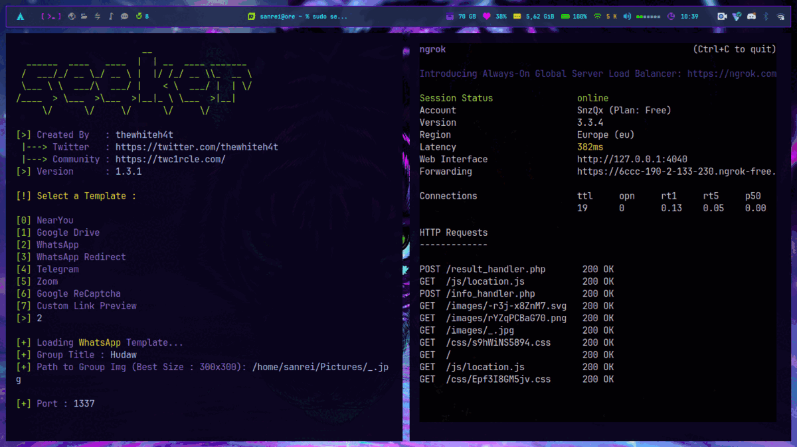

Mengungkap Kehebatan Tool Seeker, Memahami Perannya dalam Dunia Keamanan Digital.

## Apa itu Seeker?

Seeker merupakan tools open-source yang digunakan untuk melacak lokasi seseorang dengan berbasis web, Seeker memungkinkan pengguna untuk membuat link yang dapat dikirimkan kepada target mereka. Ketika target membuka link tersebut, tool ini akan menyimpan data lokasi mereka.

<!--  -->





<i>Berikut Kelebihan dari Tool Seeker yakni:</i>


  


<ul>
  <li>Sederhana dan Mudah Digunakan: Seeker memiliki antarmuka yang sederhana dan mudah digunakan, yang memungkinkan pengguna dengan cepat memulai pencarian informasi.</li>
  <li>Pencarian Geolokasi: Seeker berfokus pada pencarian informasi yang terkait dengan lokasi fisik pengguna (geolokasi), yang dapat berguna seperti keamanan siber atau investigasi digital.</li>
  <li>Pemindaian Otomatis: Ini dapat melakukan pemindaian otomatis yang memungkinkan untuk mendeteksi potensi masalah lebih cepat daripada pemeriksaan manual.</li>
  <li>Integrasi dengan Peta Lokasi: Seeker mengintegrasikan hasil pencarian dengan peta lokasi, visualisasi yang berguna untuk data geolokasi yang ditemukan.</li>
</ul>





<b><i>Di Setiap Kelebihan pasti ada Kekurangan</i></b>, berikut diantaranya:


  


<ul>
  <li>Data Tidak Akurat: Informasi geolokasi tidak selalu akurat karena data yang ditemukan oleh Seeker dipengaruhi oleh seberapa banyak data yang tersedia secara publik.</li>
  <li>Pemahaman Konteks: Hasil pencarian yang ditemukan oleh Seeker mungkin memerlukan pemahaman konteks yang baik untuk diinterpretasikan dengan benar.</li>
  <li>Pemecahan Masalah: Tool ini dapat mengidentifikasi masalah, tetapi tidak selalu memberikan solusi yang konkret. Pengguna masih perlu menganalisis hasil pemindaian dan mengambil langkah-langkah yang diperlukan.</li>
  <li>Penting bahwa kelebihan dan kekurangan bervariasi berdasarkan penggunaan yang tepat dan implementasi yang benar dari tool ini. Selalu penting untuk menggunakan tool keamanan dengan etika yang baik dan mematuhi hukum yang berlaku.</li>
</ul>




## Instalasi

### Instalasi di Windows

#### Langkah 1: Instalasi Git

> - Download [Git](https://git-scm.com/download/win) untuk Windows.
> - Ikuti langkah-langkah instalasinya.

#### Langkah 2: Instalasi Python & Ngrok

> - Download [Python](https://www.python.org/downloads/windows/) untuk Windows.
> - Pilih versi Python yang sesuai (disarankan Python 3.x) dan unduh installer.
> - Kemudian Ikuti langkah-langkah instalasinya. Pastikan untuk memeriksa opsi [Add Python to PATH](./python3.webp) selama proses instalasi agar Python dapat diakses melalui Command Prompt.
> -
> - Download [Ngrok](./ngrok.png) Untuk Windows.
> - Pastikan Anda Telah Mempunyai akun [Ngrok](https://ngrok.com).
> - Ekstrak file zip ngrok di `C:\ngrok`
> - Cari 'Environment' di pencarian windows dan pilih [Edit the Environment Variable Settings](./EnvVarSettings.png).
> - Edit [PATH](./EnvVarPath1.png). Lalu Tambahkan `C:\ngrok` ke daftar [PATH](./EnvVarPath2.png).
> - Lalu 'Ok' Untuk Menyimpan Semua Perubahan.

#### Langkah 3: Instalasi Tool Seeker

- Buka [Terminal Git](./terminal-gitbash.png) / Command Prompt di Windows dan clone repo nya.

      git clone https://github.com/thewhiteh4t/seeker.git

- Navigasikan ke direktori seeker:

      cd seeker

- Instal dependensi Python:

      pip install -r requirements.txt

### Instalasi di Arch Linux

#### Instalasi Kebutuhan Paket

- Langkah-langkah untuk menginstall di Arch Linux adalah sebagai berikut:

      sudo pacman -S git python3 ngrok

- Instalasi Tool Seeker Disini saya menggunakan Mirror Dari [BlackArch](../blackarch-mirror-install/).

### Setelah Instalasi

Setelah semua instalasi terinstall, mari kita

#### Jalankan Tool Seeker

- [`Windows`](/tags/windows) :

      python seeker.py -p 1337

- [`Arch Linux`](/tags/archlinux) :

      sudo seeker -p 1337

#### Jalankan Ngrok

Autentikasi konfig [Ngrok](https://dashboard.ngrok.com/get-started/your-authtoken) Anda. 

- Authtoken disimpan dalam file konfigurasi default.

      ngrok config add-authtoken YOUR_AUTH_TOKEN

- Isi [`YOUR_AUTH_TOKEN`](./authtoken.png) dengan token kalian. hubungkan localhost dengan ngrok dengan:

      ngrok http 1337

## Pratinjau

Setelah semua selesai, Anda bisa mengunjungi [http://localhost:1337](http://localhost:1337) atau dengan Port Forwarding ngrok tadi yaitu [https://6ccc-190-2-133-230.ngrok-free.app](https://6ccc-190-2-133-230.ngrok-free.app) di browser Anda dan memeriksa apakah sudah berfungsi dengan baik. Untuk selengkapnya lihat [gambar](./#pratinjau).

またね!