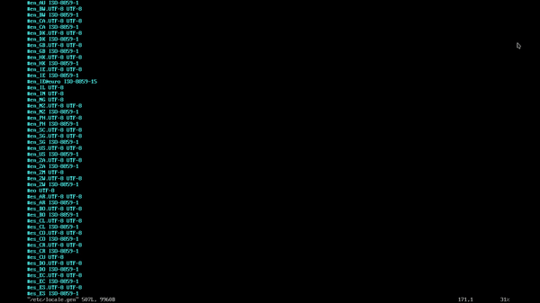

- The boot mode is **EFI**.
- I'm assuming that you already have a USB stick with an Arch Linux ISO and are already  [```BOOTABLE```](https://id.wikipedia.org/wiki/List_of_tools_to_create_bootable_USB)

Bring something in your food cupboard to enjoy the relaxing process ☕ ...

# Link

1. [Download the Latest Arch Linux ISO](https://archlinux.org/download/)
2. [Connect to the Internet - Arch Linux Wiki](https://wiki.archlinux.org/title/installation_guide#Connect_to_the_internet)
3. [Swap - Arch Linux Wiki](https://wiki.archlinux.org/title/Swap)
4. [Adilhyz´s bspwm dotfiles install](https://github.com/adilhyz/dotfiles-v1)

## 1. Pre-Install

### 1.1 Set Time

```sh
timedatectl set-ntp true
```

### 1.2 Partitioning the Disk

I will create 2 Partitions.

- [x] Part for Arch Linux (Btrfs)
- [x] Part for Swap
- [ ] EFI partition, here I dualboot with windows (Optional)


```sh
cfdisk /dev/[device]
```
This is the disk structure that has been created ```1``` and also ```2```

```bash
NAME        MAJ:MIN RM   SIZE RO TYPE MOUNTPOINTS
sda           8:0    1  29.3G  0 disk
├─sda1        8:1    1  29.2G  0 part [BOOTABLE]
└─sda2        8:2    1    32M  0 part
nvme0n1     259:0    0 238.5G  0 disk
├─nvme0n1p1 259:1    0  89.3G  0 part [WINDOWS]
├─nvme0n1p2 259:2    0   511M  0 part [EFI-WINDOWS]
├─nvme0n1p3 259:3    0   712M  0 part [RECOVERY-WINDOWS]
├─nvme0n1p4 259:4    0    40G  0 part [MYDATA]
├─nvme0n1p5 259:5    0     8G  0 part [SWAP] (1)
└─nvme0n1p6 259:6    0   100G  0 disk [ARCH] (2)
```

### 1.3 Formatting partitions

Before formatting, it is better to back up the mirrorlist first.

```sh
cp /etc/pacman.d/mirrorlist /etc/pacman.d/mirrorlist.ori
```

create arch system partitions

```sh
mkfs.btrfs /dev/nvme0n1p6 -L NYARCH -f
mkswap /dev/nvme0n1p5
swapon /dev/nvme0n1p5
```

### 1.4 Change Mirrorlist

```sh
reflector --list-countries
reflector --country Indonesia --latest 5 --sort rate --save /etc/pacman.d/mirrorlist
```

update all keys

```
pacman -S archlinux-keyring
pacman-key --populate
```

### 1.5 Creating Subvolumes and Mounting

```sh
mount /dev/nvme0n1p6 /mnt
cd /mnt
btrfs su cr @
btrfs su cr @home
btrfs su cr @cache
btrfs su cr @images
btrfs su cr @log
btrfs su cr @tmp
btrfs su cr @snapshots
cd
umount /mnt
```

```sh
mount -o compress=zstd:3,noatime,subvol=@ /dev/nvme0n1p6 /mnt
mkdir -p /mnt/{boot/efi,home,tmp,.snapshots,var/{cache,log,lib/libvirt/images}}
mount -o compress=zstd:3,noatime,subvol=@home /dev/nvme0n1p6 /mnt/home
mount -o compress=zstd:3,noatime,subvol=@tmp /dev/nvme0n1p6 /mnt/tmp
mount -o compress=zstd:3,noatime,subvol=@cache /dev/nvme0n1p6 /mnt/var/cache
mount -o compress=zstd:3,noatime,subvol=@log /dev/nvme0n1p6 /mnt/var/log
mount -o compress=zstd:3,noatime,subvol=@images /dev/nvme0n1p6 /mnt/var/lib/libvirt/images
mount -o compress=zstd:3,noatime,subvol=@snapshots /dev/nvme0n1p6 /mnt/.snapshots

mount /dev/nvme0n1p2 /mnt/boot/efi
```
In my case I used zstd as compression.


Why zstd?


> Zstandard, also known as zstd, is a fast and unobtrusive compression method designed for straightforward compression situations, surpassing the effectiveness of the widely used zlib level. zstd has a fast entropy stage thanks to strong support from the [Huff0 and FSE]((https://github.com/Cyan4973/FiniteStateEntropy)) libraries.

This is a quick benchmark of the differences between zstd and other compressions:

| Compression Algorithm | Compression Ratio| Compression Speed| Decompression Speed |
|-----------------------|------------------|------------------|---------------------|
| Zstd                  | High             | Fast             | Fast                |
| Brotli                | Very High        | Medium           | Medium              |
| Deflate (gzip)        | Low              | Fast             | Fast                |
| LZ77 (gzip)           | Medium           | Medium           | Fast                |
| Snappy                | Low              | Very Fast        | Very Fast           |
| LZO                   | Low              | Very Fast        | Very Fast           |
| Gzip                  | Medium           | Medium           | Fast                |

At first glance, Zstd excels in high compression ratio and faster compression speed, while Brotli offers a very high compression ratio with minimal sacrifice in compression and decompression speed. However, this comparison is highly dependent on the characteristics of the specific data being tested and the unique needs of each application.

## 2. Installations

### 2.1 Install the Base System

This will depend on the processor brand (AMD or Intel)

- Intel Processors add the ``intel-ucode`` package
- AMD Processors add the ``amd-ucode`` package

```sh
pacstrap /mnt base linux linux-zen linux-firmware git vim intel-ucode
```

*Press enter twice here..*

## 3. Configuring the System

### 3.1 Generate fstab

```sh
genfstab -U /mnt >> /mnt/etc/fstab
cat /mnt/etc/fstab
```
Then copy backup the mirrorlist:

```sh
cp /etc/pacman.d/mirrorlist.ori /mnt/etc/pacman.d/mirrorlist.ori
```

### 3.2 Chroot

```sh
arch-chroot /mnt
```

### 3.3 Localization

List all time zones:
```sh
timedatectl list-timezones
```

Replace region and city with your time zone.
```sh
ln -sf /usr/share/zoneinfo/Asia/Jakarta /etc/localtime
hwclock --systohc
```

Edit and delete comments with your locale.
```sh
vim /etc/locale.gen 
```


```sh
echo LANG=en_US.UTF-8 >> /etc/locale.conf
```

```sh
locale-gen
```

### 3.4 Network Configuration
Create ``/etc/hostname`` :

```sh
echo "ore" >> /etc/hostname
```

Then Create ```/etc/hosts```:

```
127.0.0.1   localhost
::1         lobalhost
127.0.1.1   ore.localdomain     ore
```

Replace all "ore" with your desired host.

 and [ILoveCandy](#pacman.conf)")

### 3.5 Installation Package Requirement

This is generally with ```pacman -S . . .```, here I make it easy for you with installation from text without typing per package.

```sh
git clone https://github.com/adilhyz/ArchLinux AIO
```
Install the package
```sh
pacman -S --needed - < /AIO/Paclists/Bspwm/needed
```

### 3.6 Edit mkinitcpio

Add btrfs binaries to ```/etc/mkinitcpio.conf```

```sh
vim /etc/mkinitcpio.conf

# Add btrfs
> binaries=(btrfs)
```

### 3.7 GRUB Installation

Edit file ```/etc/default/grub```

```sh
vim /etc/default/grub

#Delete Comment On
OS_PROBER=false

```

Finally Install Grub with ```grub-install```

```sh
grub-install --target=x86_64-efi --efi-directory=/boot/efi --bootloader-id=ARCH --recheck
grub-mkconfig -o /boot/grub/grub.cfg
```

## 4. Post-Installation

### 4.1 Aktifkan services systemctl

```sh
systemctl enable NetworkManager
systemctl enable bluetooth
systemctl enable dhcpcd
systemctl enable avahi-daemon
systemctl enable cups
systemctl enable haveged
systemctl enable sshd
systemctl enable reflector.timer
systemctl enable fstrim.timer
systemctl enable libvirtd
```

### 4.2 Add User

```sh
useradd -m -G sys,log,network,floppy,scanner,power.rfkill,users,video,storage,optical,lp,audio,wheel,adm sanrei
```

Add password ```user```

```sh
passwd sanrei
```

### 

Edit ```/etc/sudoers``` jalankan ```visudo``` and delete the following line::

```sh
EDITOR=nvim visudo

#Delete Comment wheel
%wheel ALL=(ALL) ALL
```

```sh
exit
```

## 5. Bspwm installation

You are now at [```tty```](https://en.wikipedia.org/wiki/TTY). We need to download the repository but here I have created an installer. I made this to make installation easier and avoid rework.

**Download installer package**
```sh
curl https://raw.githubusercontent.com/adilhyz/dotfiles-v1/master/RiceInstaller -o RiceCuy
chmod +x RiceCuy
./RiceCuy
```

> After bspwm installation
>
> Install this all in one package bundled with **media player** ```vlc``` and also **browser** ```firefox``` for more details check [My Arch Linux Requirements Package](https://github.com/adilhyz/ArchLinux)

```sh
sudo pacman -S --needed - < /AIO/Paclists/Bspwm/needed
```

Finally enable **Display Manager**

```sh
sudo systemctl enable sddm
reboot
```

## 6. Congratulations Nyarch linux has been installed on your desktop

Repository: https://github.com/adilhyz/dotfiles-v1

Visit the [dotfiles](/posts/arch-linux-dotfiles/) bspwm repository and I've prepared simple installation documentation. Hopefully this information will be useful to you in maximizing the use of your computer!

<!-- 

 -->