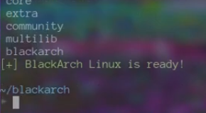
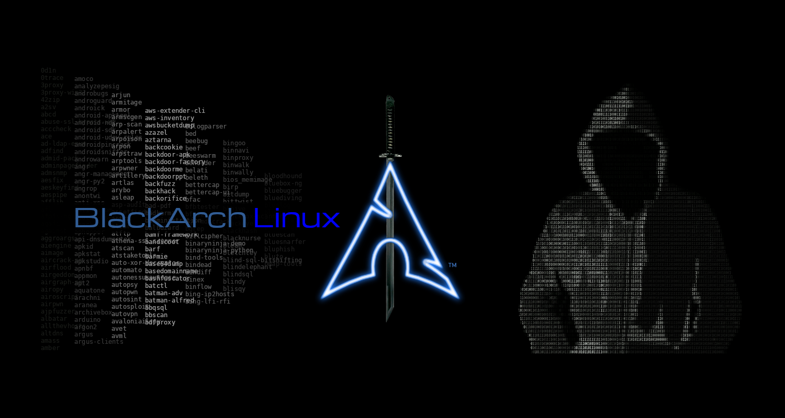
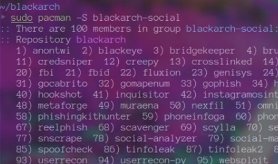

Pada Arch Linux, "mirror" merujuk pada salinan repositori paket perangkat lunak yang memungkinkan pengguna mengunduh dan mengelola perangkat lunak dengan cepat. Repositori mirror adalah server yang menyediakan akses ke paket-paket ini dari berbagai lokasi geografis, memfasilitasi distribusi beban jaringan yang lebih baik dan kecepatan unduh yang lebih cepat. Mirror mirrorsync, di sisi lain, adalah salinan semua repositori Arch Linux yang diorganisir oleh repositori utama, yang digunakan untuk memastikan bahwa repositori mirror tetap mutakhir dengan secara otomatis mengelola dan mengisinya.

## Pendahuluan
Dalam konteks BlackArch, mirror adalah salinan repositori perangkat lunak BlackArch Linux, yang berisi berbagai alat keamanan dan peretasan. Mirror ini memungkinkan pengguna untuk mengunduh dan menginstal paket BlackArch dengan cepat.

## Instalasi Mirror BlackArch.

Installer ini hanya bekerja untuk [`ARCH`](https://archlinux.org) Linux, dan distro basenya.

Download file dari https://blackarch.org/strap.sh dengan menggunakan curl

    curl -O https://blackarch.org/strap.sh

Verifikasi jumlah SHA1

    echo 5ea40d49ecd14c2e024deecf90605426db97ea0c strap.sh | sha1sum -c

Mengatur bit eksekusi

    chmod +x strap.sh

Jalankan strap.sh

    sudo ./strap.sh

Aktifkan multilib mengikuti [wiki](https://wiki.archlinux.org/index.php/Official_repositories#Enabling_multilib) dan jalankan:

    sudo pacman -Syu

## Setelah Instalasi
Setelah instalasi, Anda dapat mencoba beberapa alat seperti pentesting, jaringan, eksploitasi dan lainnya. kemudian pilih alat yang Anda sukai dan juga Anda butuhkan.

Anda juga dapat melihat kategori blackarch dengan menggunakan perintah

    sudo pacman -Sg | grep blackarch

    sudo pacman -S blackarch-<kategori>

Dalam artikel hari ini, saya menjelaskan cara menginstal BlackArch Mirror. BlackArch Mirror adalah Mirror pilihan saya dan saya menggunakannya. Jika Anda masih bingung, Anda dapat melihat [Youtube](https://youtube.com/@adilhyz) Saya. またね!