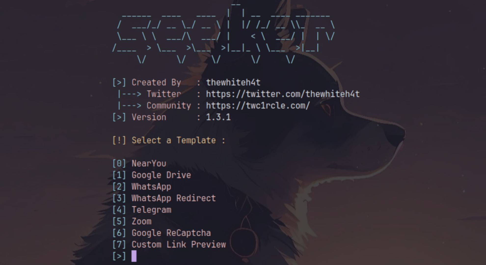

Track Location Using (Seeker Tool)

    https://github.com/thewhiteh4t/seeker






  








。。。
<!-- 
  
 -->



。。。
<ul>
  <li>。。。</li>
  <li>。。。</li>
  <li>。。。</li>
</ul>

<!-- 
  

 -->



Arigatou。
