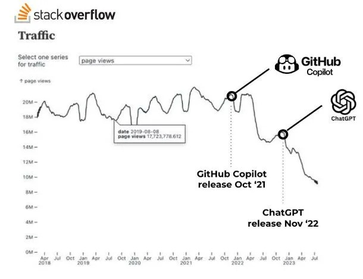

# Ketika Stack Overflow Mati, AI Menjadi Guru Baru Programmer

## Stack Overflow

Stack Overflow dulu bukan hanya forum tanya jawab pertanyaan. melainkan Otak Kolektif para Developer. Setiap pertanyaan yang dijawab artinya ada Seseorang di belahan Dunia ini yang pernah mengalami hal yang sama. Pengetahuan dibangun lewat diskusi, perdebatan, dan Pengalaman nyata oleh Manusia.

Tapi di era AI sekarang, semuanya berubah. Model bahasa raksasa (*LLM*) Seperti **ChatGPT**, **Claude**, dan **Gemini** dilatih menggunakan Dataset raksasa, Termasuk dump Publik Stack Overflow. Artinya, Pengetahuan Komunitas yang dulu terbuka kini disedot, dimanfatkan, dan diolah oleh Mesin. 

Yang lebih ironisnya, Sekarang banyak Developer yang tak lagi mengunjungi Stack Overflow Seperti dulu. Mereka langsung tanya ke AI, yang justru belajar dari Stack Overflow itu sendiri. Sebuah siklus yang Aneh, **Manusia menciptakan sumber pengetahuan**, **lalu menyerahkannya kembali kepada mesin**.

Masih ingatkah masa-masa setiap error dibuka dengan kalimat,

> “*Cek aja Stack Overflow.*”

Kalimat itu dulu sakral bagi Programmer. sebuah mantra yang menyelamatkan dari runtime error, bug, dan Insomnia.Tapi kini, suara itu sudah mulai hilang, dan Tergantikan oleh Bisikan Baru:

> “*Tanya aja ke ChatGPT.*”

Stack Overflow belum benar mati, tapi Perannya Perlahan sudah diambil alih. Dan Penggantinya bukan Manusia, melainkan Kecerdasan Buatan Atau **AI** (*Artifical Intellegence*).

> ## Keheningan di Forum yang Dulu Sangat Ramai

Jika pernah aktif di Stack Overflow Setidaknya di tahun 2020, Saya masih ingat betapa ramainya Developer dari seluruh dunia menanyakan Solusi Error nya di forum ini.

ada *meme* error, perdebatan sengit soal best practice, hingga Jawaban Legendaris yang jadi referensi Jutaan Developer. Tapi sejak **AI** generatif populer, Traffic Stack Overflow menurun drastis, beberapa laporan menyebut hingga **turun 50–60% sejak 2022**. Pertanyaan baru makin sedikit, jawaban makin jarang, dan yang aktif kini hanyalah moderator serta Bot Otomatis.

Komunitas kehilangan tujuannya.
Sama Seperti perpustakaan yang ditinggalkan karena semua orang punya “**asisten pribadi**” di rumah masing-masing. Alias metafora AI itu sendiri

> ## AI Sebagai Pembantu, Menjadi Guru

Sejak awal AI Rilis Seperti **ChatGPT**, Kita menggunakan AI ini untuk membantu Hal Kecil, yakni Melengkapi kode, Menjelaskan error, atau Menulis Dokumentasi. Tapi Perlahan-lahan, AI mulai jadi Guru Utama tempat pertama yang Kita datangi untuk mencari solusi.

Tidak ada lagi diskusi panjang atau Pencarian Manual.
Sekarang tinggal tanya, Misalnya:

> “*Buatkan Aplikasi Kasir Berbasis Laravel Lengkap Dengan Database nya*.”

Dan ya dalam Waktu Singkat, AI menjawab, dengan Penjelasan, Komentar, dan contoh Penggunaan.

> [!IMPORTANT]
> Masalahnya, AI bukan Guru, Tapi Pengulang.

AI tidak “**mengerti**”, tapi “**meniru**”.
AI tidak tahu Apa Dan Mengapa sesuatu benar, 

Ia hanya tahu pola dari Ratusan bahkan Jutaan contoh sebelumnya.
Namun Manusia Tetap Percaya, Karena hasilnya terlihat benar.

## Saat Pengetahuan jadi komoditas

Yang dulu gratis kini berbayar.

Stack Overflow berdiri Atas Semangat Knowledge Sharing (*Berbagi Pengetahuan*), tapi AI platform kini berdiri atas Knowledge Monetization (*Berbagi Monetisasi*).

Setiap kali Kita menanyakan sesuatu ke model Seperti ChatGPT atau Claude, Kita sebenarnya “**membayar”** untuk akses ke data kolektif umat Manusia yang telah dikurasi ulang oleh Algoritma.

> [!QUESTION] Apakah adil jika AI menghasilkan uang dari data Publik yang dibuat oleh komunitas Open Source?

> [!QUESTION]Apakah pengetahuan masih milik bersama, atau kini milik perusahaan yang paling kuat server-nya?

Bahkan, **Stack Overflow** sendiri akhirnya menyerah.
Pada 2024, mereka menandatangani perjanjian dengan **OpenAI** untuk **menyediakan Dataset resmi Stack Overflow** bagi pelatihan model GPT.

Ironis, bukan?
Platform Tanya Jawab Manusia kini secara resmi **menyediakan bahan ajar bagi pengganti Manusianya sendiri**.



## Hilangnya Seni Bertanya

Salah satu skill paling penting seorang programmer bukanlah menulis kode, tapi **bertanya dengan benar**.

“***Bagaimana caranya Saya menjelaskan Masalah Saya agar orang lain paham?***”

Di Stack Overflow, Seni bertanya dilatih. kadang lewat Kritik keras, kadang lewat Edit komunitas.
Tapi di era AI Sekarang, Semua Jawaban Datang begitu saja, Tanpa Perlu berpikir keras.

> ### Kita jadi manja.

Kita tidak lagi mencari konteks, Kita hanya menunggu solusi.

AI bukan lagi alat bantu berpikir, Ia sudah mengambil Alih Proses Berpikir itu sendiri.

> [!WARNING]Dan pada titik dimana Pengetahuan berhenti bertumbuh, Kita hanya memutar ulang hasil olahan mesin, tanpa menciptakan Sesuatu yang baru.

## Komunitas yang Terpecah

Dulu, semua Developer, dari junior sampai senior, berkumpul di satu tempat.

Sekarang, mereka terpecah ke berbagai AI assistant: Copilot, Cody, Gemini, ChatGPT, dll.

Setiap orang hidup di Ekosistemnya sendiri, dengan Model AI yang menyesuaikan Gaya dan Preferensi Pribadi-nya.

Hasilnya?

**Tidak ada lagi ruang belajar bersama.**

Tidak ada lagi percakapan global antar Developer tentang “**cara terbaik**” mengerjakan sesuatu. Yang tersisa hanyalah ruang privat antara Manusia dan mesin. Komunitas Open Source yang dulu jadi simbol kolaborasi, kini Berubah Jadi kumpulan Pulau-Pulau Kecil, Masing-Masing ditemani Asisten AI-nya sendiri.

> ## AI, **Dewa Baru** di Dunia Pemrograman?

Sedikit berlebihan? Mungkin. Tapi lihat kenyataannya. Kita sekarang memuja AI Seperti **Pemecah Masalah Absolut**. Kita percaya semua Error punya solusi dalam Satu Prompt. Kita tidak lagi meragukan hasilnya, Kita hanya menyesuaikan diri.

Seperti Kepercayaan, AI memberi Kenyamanan, Kepastian, dan Jawaban cepat.
Dan Seperti Kepercayaan pula, Kita berhenti mempertanyakan.

Di Masa Mendatang, Mungkin tidak akan ada lagi “**Senior Developer**”. Hanya akan ada Manusia yang tahu cara berbicara dengan AI lebih efisien daripada yang lain. Dan Dimana “**Coding Skill**” berubah menjadi “**Prompting Skill**”.

## Masih adakah Harapan?

> Masih. Tapi tidak akan sama.

++Stack Overflow tidak akan hidup lagi Seperti dulu, tapi Semangatnya, Kolaborasi, Transparansi, dan Dokumentasi. Bisa Kita jaga lewat bentuk baru.++

Beberapa proyek menarik mulai muncul:

- Forum Open Source kecil yang pakai AI hanya sebagai moderator, bukan Guru.

- Dataset Open Knowledge yang dirilis Publik agar tidak dimonopoli korporasi.

- Inisiatif komunitas lokal untuk melatih model bahasa dari data mereka sendiri.

++Mungkin Stack Overflow mati, tapi Jiwa nya bisa hidup di tempat lain++, Selama Masih ada Manusia yang Mau berbagi, Bukan hanya bertanya.

## Referensi

- [The Verge – “Stack Overflow’s Traffic Plummets as Developers Flock to ChatGPT”](https://www.theverge.com/2024/5/8/stack-overflow-traffic-plummets-ai)
- [MIT Technology Review – “AI Training and the Ethics of Using Public Data”](https://www.technologyreview.com/2025/01/17/ai-training-public-data-ethics)
- [Ars Technica – “Stack Overflow Partners with OpenAI for Dataset Licensing”](https://arstechnica.com/information-technology/2024/05/stack-overflow-openai-Dataset-licensing)
- [IEEE Spectrum – “The Decline of Developer Forums in the Age of AI”](https://spectrum.ieee.org/ai-Developer-forums-decline)

---

> Penulis: [Adilhyz](https://github.com/adilhyz)  
> URL: https://sanrei.my.id/posts/ai-gantikan-stackoverflow/  

