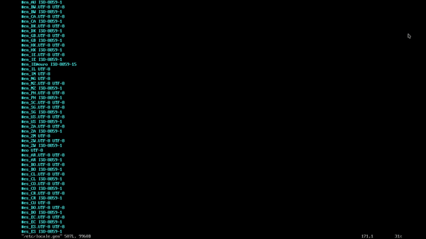

# Instalasi Arch Linux Full Dengan Bspwm


## Arch Linux

Hai semua, kali ini saya akan mengshare, cara menginstal **Arch Linux** dengan Window Manager **bspwm**. File sistemnya **btrfs**, Ada dua Opsi untuk instalasi **Arch Linux** Yaitu Otomatis dengan [archinstall](https://wiki.archlinux.org/title/Archinstall) Dan Manual. 

>[!note]
>Disini saya memilih manual karena lebih leluasa mengkonfigurasi **Arch Linux** kita.

- Mode bootingnya adalah **EFI**.
- Saya berasumsi bahwa stik USB dengan ISO Arch Linux dan sudah [```BOOTABLE```](https://en.wikipedia.org/wiki/List_of_tools_to_create_bootable_USB)

Jangan lupa siapkan cemilan biar instalasinya makin santai ☕😄

## Link

- 

- [Konek ke Internet - Arch Linux Wiki](https://wiki.archlinux.org/title/installation_guide#Connect_to_the_internet)
- [Swap - Arch Linux Wiki](https://wiki.archlinux.org/title/Swap)
- [My Required Package Bspwm](https://github.com/adilhyz/archlinux)
- [Adilhyz´s bspwm dotfiles install](https://github.com/adilhyz/dotfiles-v1)

## Pra-Instalasi

Sebelum Lanjut ke tahap berikutnya, Kita diharuskan Untuk koneksi ke Internet di Arch Linux Kalian bisa baca dokumentasi di [Arch Linux Wiki - Konek ke Internet](https://wiki.archlinux.org/title/installation_guide#Connect_to_the_internet)

### Atur Waktu

```sh {title="tty"}
timedatectl set-ntp true
```

### Buat Partisi Disk

Disini saya akan membuat 2 Partisi.

- [x] Partisi untuk Arch Linux (Btrfs)
- [x] Partisi Untuk Swap
- [ ] Partisi EFI (Opsional), disini saya Dualboot dengan windows

```sh {title=tty}
cfdisk /dev/[device]
```
Ini adalah struktur disk yang sudah di create ```1``` dan juga ```2```

```bash {title=lsblk}
NAME        MAJ:MIN RM   SIZE RO TYPE MOUNTPOINTS
sda           8:0    1  29.3G  0 disk
├─sda1        8:1    1  29.2G  0 part [BOOTABLE-NYA]
└─sda2        8:2    1    32M  0 part
nvme0n1     259:0    0 238.5G  0 disk
├─nvme0n1p1 259:1    0  89.3G  0 part [WINDOWS]
├─nvme0n1p2 259:2    0   511M  0 part [EFI-WINDOWS]
├─nvme0n1p3 259:3    0   712M  0 part [RECOVERY-WINDOWS]
├─nvme0n1p4 259:4    0    40G  0 part [MYDATA]
├─nvme0n1p5 259:5    0     8G  0 part [SWAP] <-- (1) UNTUK SWAP
└─nvme0n1p6 259:6    0   100G  0 disk [ARCH] <-- (2) PARTISI YANG AKAN DI INSTALL
```

### Memformat partisi

Sebelum memformat Alangkah baiknya untuk membackup Mirrorlist terlebih dahulu, Karena kita akan menggunakan Mirror dari **reflector**

```sh {title=tty}
cp /etc/pacman.d/mirrorlist /etc/pacman.d/mirrorlist.ori
```

Sesudah membackup Mirror kita lanjut Format Partisi Dan Swap, Gunakan **mkfs.btrfs**, **mkswap** dan **swapon**.

```sh {title=tty}
mkfs.btrfs /dev/nvme0n1p6 -L NYARCH -f
mkswap /dev/nvme0n1p5
swapon /dev/nvme0n1p5
```

### Mengganti Mirrorlist

```sh {title=tty}
reflector --list-countries
reflector --country Indonesia --latest 5 --sort rate --save /etc/pacman.d/mirrorlist
```
Update semua key untuk men-sinkron kan Mirror Ke Server Yang dipilih **reflector**

```sh {title=tty}
pacman -S archlinux-keyring
pacman-key --populate
```

### Membuat Subvolume dan Mountings

```sh {title=tty}
mount /dev/nvme0n1p6 /mnt
cd /mnt
btrfs su cr @
btrfs su cr @home
btrfs su cr @cache
btrfs su cr @images
btrfs su cr @log
btrfs su cr @tmp
btrfs su cr @snapshots
cd
umount /mnt
```

```sh {title=tty}
mount -o noatime,ssd,compress=zstd:3,space_cache=v2,discard=async,subvol=@ /dev/nvme0n1p6 /mnt
mkdir -p /mnt/{boot/efi,home,tmp,.snapshots,var/{cache,log,lib/libvirt/images}}
mount -o noatime,ssd,compress=zstd:3,space_cache=v2,discard=async,subvol=@home /dev/nvme0n1p6 /mnt/home
mount -o noatime,ssd,compress=zstd:3,space_cache=v2,discard=async,subvol=@tmp /dev/nvme0n1p6 /mnt/tmp
mount -o noatime,ssd,compress=zstd:3,space_cache=v2,discard=async,subvol=@cache /dev/nvme0n1p6 /mnt/var/cache
mount -o noatime,ssd,compress=zstd:3,space_cache=v2,discard=async,subvol=@log /dev/nvme0n1p6 /mnt/var/log
mount -o noatime,ssd,compress=zstd:3,space_cache=v2,discard=async,subvol=@images /dev/nvme0n1p6 /mnt/var/lib/libvirt/images
mount -o noatime,ssd,compress=zstd:3,space_cache=v2,discard=async,subvol=@snapshots /dev/nvme0n1p6 /mnt/.snapshots

```

Sebelum nya disini Saya menggunakan **zstd** sebagai kompresi.

> [!question]Kenapa **zstd**
> **zstd** atau Zstandard, adalah metode kompresi yang cepat dan tidak mengganggu yang dirancang untuk situasi kompresi secara langsung, melampaui efektivitas level zlib yang banyak digunakan. zstd memiliki tahap entropi yang cepat berkat dukungan yang kuat dari library [Huff0 dan FSE](https://github.com/Cyan4973/FiniteStateEntropy)

berikut benchmark perbedaan singkat antara zstd dan kompresi lainnya:

| Algoritma Kompresi | Rasio Kompresi| Kecepatan Kompresi| Kecepatan Dekompresi |
|--------------------|---------------|-------------------|----------------------|
| Zstd               | Tinggi        | Cepat             | Cepat                |
| Brotli             | Sangat Tinggi | Sedang            | Sedang               |
| Deflate (gzip)     | Rendah        | Cepat             | Cepat                |
| LZ77 (gzip)        | Sedang        | Sedang            | Cepat                |
| Snappy             | Rendah        | Sangat Cepat      | Sangat Cepat         |
| LZO                | Rendah        | Sangat Cepat      | Sangat Cepat         |
| Gzip               | Sedang        | Sedang            | Cepat                |

Sekilas, **zstd** unggul dalam rasio kompresi yang tinggi dan kecepatan kompresi yang lebih cepat, sementara Brotli menawarkan rasio kompresi yang sangat tinggi dengan pengorbanan minimal dalam kecepatan kompresi dan dekompresi. Namun, perbandingan ini sangat bergantung pada karakteristik data spesifik yang sedang diuji dan kebutuhan unik setiap aplikasi.


## Instalasi

### Instalasi Base System

> [!note]Pilih paket instalasi sesuai dengan Prosesor (AMD atau Intel)
> Jika Intel Gunakan paket ```intel-ucode``` / AMD tambahkan paket ```amd-ucode```


{}

```sh {title=tty}
pacstrap /mnt base linux linux-zen linux-firmware git vim intel-ucode
```

{}
{}

```sh {title=tty}
pacstrap /mnt base linux linux-zen linux-firmware git vim amd-ucode
```

{}


*Tekan enter dua kali di sini...*

## Mengkonfigurasi Sistem

### Membuat fstab

```sh {title=tty}
genfstab -U /mnt >> /mnt/etc/fstab
cat /mnt/etc/fstab
```
Lalu copy backupan mirrorlist dengan:

```sh {title=tty}
cp /etc/pacman.d/mirrorlist.ori /mnt/etc/pacman.d/mirrorlist.ori
```

### Chroot

Jika sudah Kita masuk ke [mounting tadi](#membuat-subvolume-dan-mountings) yaitu ```/mnt```

```sh {title=tty}
arch-chroot /mnt
```

### Pelokalan Waktu

Lihat semua zona waktu:
```sh {title=tty}
timedatectl list-timezones
```

Ganti wilayah dan kota dengan zona waktu anda. ```/usr/share/zoneinfo/Asia/-```
```sh {title=tty}
ln -sf /usr/share/zoneinfo/Asia/Jakarta /etc/localtime
hwclock --systohc
```

Edit dan hapus komentar sesuai dengan lokal kalian.
```sh {title=vim}
vim /etc/locale.gen 
```


```sh {title=tty}
echo LANG=en_US.UTF-8 >> /etc/locale.conf
locale-gen
```

### Konfigurasi Jaringan

Buat ```/etc/hostname``` dengan:

```sh {title=tty}
echo "ore" >> /etc/hostname
```

Buat ```/etc/hosts```:

```sh {title=tty}
127.0.0.1   localhost
::1         lobalhost
127.0.1.1   ore.localdomain     ore
```

> [!tips]
> Ganti "ore" dengan host yang Anda inginkan.

Kita ubah konfigurasi pacman untuk memodifikasi Instalasi

```sh {title="vim /etc/pacman.conf"}
vim /etc/pacman.conf
```




### Instalasi Kebutuhan Paket

> [!success] Disini saya memudahkan Instalasi paket dari [repo](https://github.com/adilhyz/archlinux) 
> tanpa mengetik per-Paket. Umumnya ini dilakukan dengan ```pacman -S ... ...```

```sh {title=tty}
git clone https://github.com/adilhyz/ArchLinux AIO
```
Instalasi Paket-nya
```sh {title=tty}
pacman -S --needed - < /AIO/Paclists/Bspwm/needed
```

*Tekan enter dua kali di sini...*

### Edit mkinitcpio

Tambahkan binaries btrfs pada ```/etc/mkinitcpio.conf```

```sh {title="vim /etc/mkinitcpio.conf"}
vim /etc/mkinitcpio.conf

# Tambahkan btrfs
binaries=(btrfs)
modules=(btrfs)
```

Lalu build ulang ```mkinitcpio```
```sh {title=tty}
mkinitcpio -p linux-zen
```

Terakhir Install Grub dengan ```grub-install```


### Instalasi GRUB

```sh {title=tty}
grub-install --target=x86_64-efi --efi-directory=/boot/efi --bootloader-id=ARCH --recheck
grub-mkconfig -o /boot/grub/grub.cfg
```

## Pasca Instalasi

### Aktifkan services systemctl

```sh {title=tty}
systemctl enable NetworkManager
systemctl enable bluetooth
#systemctl enable dhcpcd (Opsional)
systemctl enable sshd
systemctl enable firewalld
systemctl enable avahi-daemon
systemctl enable cups
systemctl enable haveged
systemctl enable reflector.timer
systemctl enable fstrim.timer
systemctl enable libvirtd
systemctl enable acpid
```

### Tambahkan User

```sh {title=tty}
useradd -m -G sys,log,network,floppy,scanner,power.rfkill,users,video,storage,optical,lp,input,audio,wheel,adm sanrei
```

Tambahkan password ```user```

```sh {title=tty}
passwd sanrei
```

Edit ```/etc/sudoers``` dengan menggunakan ```visudo``` dan hapus line di:

```sh {title=tty}
EDITOR=nvim visudo

```

```sh {title="vim /etc/sudoers"}
#Hapus Komentar wheel
%wheel ALL=(ALL) ALL
```

Lalu keluar ```/mnt``` dan ```tty```, Untuk booting ulang ke **Arch Linux**
```sh {title=tty}
exit
reboot
```

> [!success] Sudah di Install
> Dan Ya Disini Arch Linux Berhasil Di install dengan Dual-Boot Windows (Opsional).


## Instalasi bspwm

Setelah memasuki halaman login user, Kita disini masih di terminal tty, yang dimana kita bebas untuk menginstalasi Jenis Desktop Environment Seperti `GNOME` `KDE` `XFCE` atau mengkonfigurasi apa-pun Tanpa Batas.

> [!info] Anda sekarang di berada [```tty```](https://en.wikipedia.org/wiki/TTY).
> Kita perlu mengunduh repositori tapi disini saya sudah buatkan Script . Yang dimana membuat Instalasi lebih mudah dan menghindari pengerjaan ulang.


**Unduh paket penginstal**
```sh
curl https://raw.githubusercontent.com/adilhyz/dotfiles-v1/master/RiceInstaller -o RiceCuy
chmod +x RiceCuy
./RiceCuy
```

> [!tip]
>Setelah instalasi bspwm, Aplikasi atau apa-pun itu masih kosong, saran saya pasang Aplikasi satu-satu, atau dengan menginstall paket all in one ini sudah di bundle dengan **media player** ```vlc``` dan juga **browser** ```firefox``` untuk selengkapnya cek [Paket Arch Linux](https://github.com/adilhyz/ArchLinux) tadi.

```sh
sudo pacman -S --needed - < /AIO/Paclists/Bspwm/needed
```

Terakhir Aktifkan **Display Manager**

```sh
sudo systemctl enable sddm
reboot
```

## Selesai

Repositori: https://github.com/adilhyz/dotfiles-v1

Jika Anda Berkenan, kunjungi repositori [dotfiles](/posts/arch-linux-dotfiles/) bspwm dan saya telah menyiapkan dokumentasi sederhana dengan instalasi nya. Semoga informasi ini berguna untuk Anda dalam memaksimalkan penggunaan komputer Anda!

## Referensi

- [The Duck Channel](https://theduckchannel.github.io/post/2021/08/20/arch-linux-full-install-with-bspwm/)

---

> Penulis: [Adilhyz](https://github.com/adilhyz)  
> URL: https://sanrei.my.id/posts/arch-linux-full-install-with-bspwm/  

