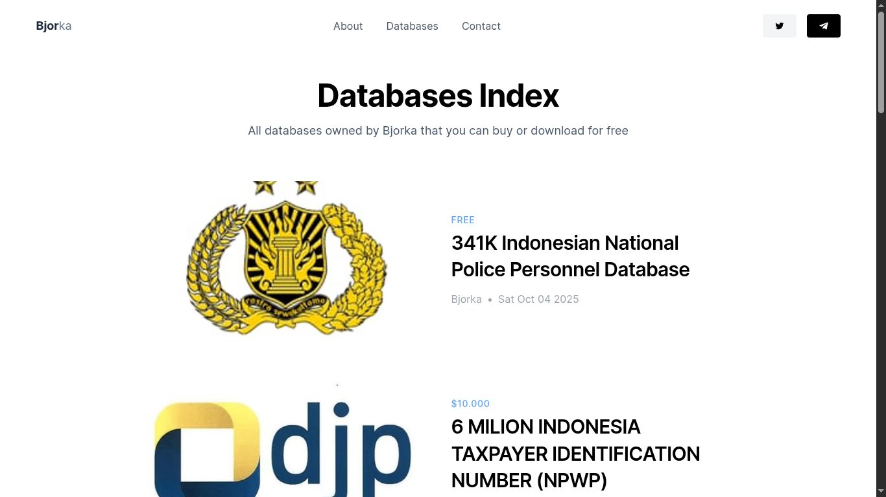

# Kebocoran Data, Fenomena Atau Drama Tahunan

Di zaman semua serba **“gratis”**. Kita, pengguna internet, seringkali tergiur dengan 
kata sakti tidak lain dan tidak bukan ya **GRATIS.**
Jika tidak asing dengan *“Gratis ongkir”*, *“Gratis kuota”*, *“Gratis nonton”*. seketika langsung reflek klik ***“Setuju dan lanjutkan”***
tanpa mikir dua kali.

Padahal, di balik itu semua, ada transaksi yang lebih mahal dari sekadar uang, yaitu **data pribadi kita.**

> ## Kalau Gratis, Kamu yang Jadi Produknya

> [!note]
> Itu kalimat klise yang gak asing banget kita denger. 

Tapi kayaknya belum benar-benar nyantol di kepala banyak orang.
Setiap kali kita install aplikasi **"gratis"** alih-alih disebut **"mod"** *(modification/modified)*, nyalain GPS, atau bikin akun baru,
di balik itu semua selalu aja ada halaman panjang yang isinya **“Terms & Conditions”**, Jika aplikasi yang di install **mod** biasanya ada sebagian saja 
karena aplikasi nya sudah di modifikasi untuk membuka fitur yang hanya bisa dibuka ketika Premium umumnya.

Dan apa yang kita lakukan?
Scroll ke bawah, centang **“I Agree”**, lanjut buka aplikasinya.
Karena siapa juga yang mau baca tulisan 12 halaman font kecil jam 2 pagi cuma buat install aplikasi foto filter kucing?

Tapi di situlah permainan dimulai.
Setiap klik, setiap like, setiap waktu kita buka kamera atau mikrofon, itu semua direkam.
Bukan buat nyari dosa, tapi buat nyari pola. Pola belanja, pola tidur,
bahkan pola kapan kita paling gampang tergoda iklan.

Aplikasi tahu jam berapa kita paling galau, lalu munculkan iklan es krim.
Tahu kita lagi jomblo, munculkan iklan parfum “buat ningkatin kepercayaan diri”.
Dan kita pun beli, tanpa sadar udah dipancing algoritma.

## Big Data

> [!warning]
> Analogi Tambang, Tapi Kita yang Jadi Mineralnya.

Data bukan cuma soal nomor telepon dan alamat email.
Itu bisa jadi lokasi yang sering kita kunjungi, jenis lagu yang kita dengerin,
sampai berapa detik kita berhenti di satu postingan.

Setiap klik, like, dan scroll jadi komoditas.
Kita dikemas rapi dalam statistik, dijual dalam bentuk *“target audience”*,
dan diiklankan balik dalam bentuk produk yang katanya *“personalized for you”*.
Padahal cuma **algoritma** yang tahu bahwa kita pernah cari *Sandal* dua hari lalu.

Bahkan detik ketika kita diam pun dianggap *“bernilai”* buat **algoritma**,
itu sinyal untuk sistem membaca *“orang ini tertarik sama hal itu.”*
Lucunya, semua itu dikumpulin, dijual, dan dipakai *buat…* menjual kita hal-hal lain.

Jadi siklusnya begini:
Kita kasih data, mereka analisis, terus mereka pake data itu buat bikin kita beli sesuatu lagi.
Gratis? Jelas enggak. Kita bayar dengan privasi.

## Hidup di Dunia yang Nggak Gratis, Tapi Mau Gratis

> [!kaminari] Kita udah terbiasa hidup di dunia yang ngasih semuanya “cuma-cuma”.
> ++Tapi yang serba gratis itu hanyalah rasa aman yang palsu.++

*Platform dapet uang dari iklan, iklan dapet target dari* **data**, dan **data** itu *dari…* ya kita juga.
Semuanya berputar manis, seperti lingkaran setan. Sekarang, kita bisa tahu harga semua barang di dunia,
tapi ***++nggak tahu++ berapa harga diri digital kita sendiri***.

*Berapa nilai preferensi politikmu di database?*,
*Berapa harga satu foto yang kamu upload ke cloud?*
Dan berapa nilai **“minat”** kamu terhadap iklan barang menarik yang muncul tiap malam di timeline?

## Data Pengguna bocor

Tiap kali ada berita kayak **“10 Juta Akun dan Password Warga Diduga Bocor”**,
semua orang rame di media sosial. Marah, ngomel, bilang *“negara open source!”*, frasa Open Source
istilah Sumber Terbuka untuk developer tetapi disini dalam artian sarkasme.

Tapi dilain sisi, sadar tidak sadar… ia telah membuka aplikasi atau link ***“Gratis Kuota 100GB”***. 
yang didalamnya bisa berupa kolom isi nama, tanggal lahir, dan yang paling bahaya adalah **izinkan akses ke kamera**.
Dengan link yang menggiurkan tersebut ia share hasilnya ke semua platform.

Ya gimana mau aman, kalau secara tidak sadar ia sendiri yang bocorin?

Jadi, lain kali kalau lihat tulisan **Apk mod** dan *“Gratis dalam bentuk apapun”*, coba pikir 2 kali:
> ***“Gratis buat siapa, ya?”***

## Ulah Hacker, Atau Kecerobohan kita sendiri

Dalam beberapa kasus, ada sekelompok Orang yang secara cuma-cuma menjual data
di BreachForum dengan user ***Bjorka***, dan Ia membuat domain sendiri nya untuk show-off untuk tujuan menjual data
diambil dari sumber domain ia sendiri yaitu http://netleaks.net.

Sampai artikel ini dibuat, Peretas ***Bjorka*** ini sudah banyak menjual data
warga ke publik, dan tentunya itu semua adalah data kita di sebarluaskan dengan gratis dan
dijual secara cuma-cuma dengan harga yang tak terbayangkan bisa sampai kisaran US`$10.000`
atau jika di Rupiah kan sekitar Rp. `16.649.100,00`.

Kalian tahu apa? ya itu **data privasi** kita semua, data yang Katanya dijanjikan tidak akan disebarluaskan itu.
kini data kita semua disebarkan dan dijual adalah **harga yang tak terbayangkan jumlahnya**,
hingga muncul benak pertanyaan:

> [!question]- Kenapa bisa, dengan adanya lembaga Badan Siber Dan Sandi Negara **(BSSN)** masih bisa dibobol?
> - Apakah lembaga siber ini ada perannya?
> - Kemana anggaran besar yang dijanjikan itu untuk memperkuat keamanan?

Dan ya, beberapa pertanyaan muncul tak terduga dalam benak pikiran Saya,
Saya tidak mau mengarahkan Artikel ini pada politik karena itu akan keluar konteks, 
namun saya punya Opini yang didasari dengan:

- Aplikasi rentan terhadap serangan Injeksi, malware, atau terkena phising serupa.
- Sistem keamanan Aplikasi yang digadang-gadang anggaran besar itu hanya dipakai sebagian kecil nya saja, selebih nya kalian tahu lah ya (ytta).
- Ada segelincir Orang yang memang Sudah muak dengan negara ini, sehingga membuat kekacauan dengan memperjual belikan data warga.

Opini Pribadi ini berdasarkan analisa yang saya lakukan dengan Pengalaman saya dalam dunia digital,
yang tak terhindarkan dari benar dan salah nya.

## Respon Apatis

> [!important]
> Kebocoran data udah bukan sekadar fenomena, tapi mungkin menjadi budaya digital kita.

Dibalik itu semua, Yang jadi sumber masalah bukan data atau berita nya yang bocor,
tapi respon Masyarakat yang mulai adaptasi dengan seringnya kebocoran ini:

*“Oh, bocor lagi? Ya udahlah, yang penting masih bisa buka TikTok.”*

kalau ada yang bocor lagi, tenang aja... tunggu bentar, nanti juga lupa lagi.
Karena pada akhirnya, data pribadi bukan lagi sesuatu yang dilindungi tapi sesuatu yang dipamerkan tanpa sadar.

Miris juga bukan?

Kalau dipikir-pikir, Indonesia mungkin satu-satunya negara di dunia
yang warganya udah kebal kebocoran data.
**Privasi?** tidak ada privasi bung, welcome to konoha.

## Kesimpulan

Dan kalau gini jadinya siapa yang salah?
> Saya pun tidak tahu, kita harus sadar diri dan tidak serakah untuk
tidak mengambil keuntungan pribadi sebelum membuat malapetaka yang lebih besar

Sekian dari saya, Terimakasih sudah menyimak sampai akhir :)

---

> Penulis: [Adilhyz](https://github.com/adilhyz)  
> URL: https://sanrei.my.id/posts/kebocoran-data/  

