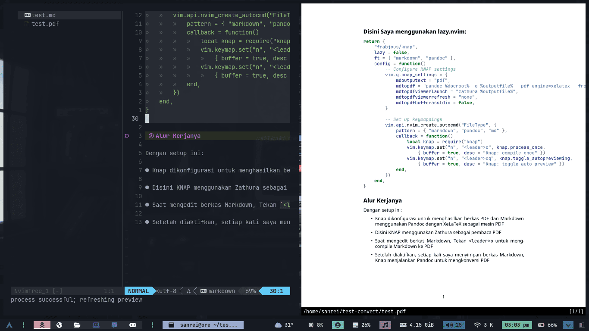

# Konversi Markdown Ke Pdf Dengan Nvim KNAP


Kevin’s Neovim Auto-Previewer **(KNAP)**, merupakan Plugin Neovim yang berfungsi 
untuk menampilkan pratinjau yang diperbarui *(Live Preview)* dengan [Zathura](https://pwmt.org/projects/zathura/).
KNAP mendukung berbagai jenis file seperti **LaTeX**, **Markdown**, dan format lainnya, dengan tampilan pratinjau (viewer).
KNAP bisa digunakan dengan fleksibel untuk memantau jenis file tertentu serta menjalankan 
perintah kustom untuk proses kompilasi dan pratinjau.


## Flow diagram
Ini adalah diagram untuk proses Plugin KNAP yang akan Saya gunakan:


flowchart TD
    A(["Neovim, dengan ekstensi markdown.md"])
    B(["Save dengan Compile: leader + o"])
    C{"Auto Preview"}
    D(["KNAP mendeteksi perubahan"])
    E(["Pandoc dijalankan untuk kompilasi PDF (XeLaTeX)"])
    F(["Zathura memperbarui compile otomatis"])
    G(["Pratinjau otomatis diperbarui"])
    H(["Pandoc dijalankan ketika di compile"])
    I(["Zathura dibuka ketika di compile"])
    J(["Pratinjau hanya muncul saat keymap leader + o"])
    K(["mdtopdfviewerrefresh = 'none'"])
    L(("Keluar (Opsi): leader + q"))

    %% Alur utama (manual)
    A --> B --> C
    C -->|Tidak| H --> I --> J --> K
    K --> L

    %% Jalur alternatif (auto preview, tidak aktif di kasus lo)
    C -.->|Ya| D -.-> E -.-> F -.-> G .-> L


## Instalasi KNAP

Sebelum instalasi saya merekomendasikan plugin [render-markdown.nvim](https://github.com/MeanderingProgrammer/render-markdown.nvim) yang dimana, 
Plugin ini untuk mempercantik tampilan ekstensi file Markdown di Neovim, supaya lebih mudah untuk 
membaca dan menulis dokumen Markdown dengan lebih nyaman dan terstruktur.

Disini Saya menggunakan lazy.nvim:

```lua {title=lsp-config.lua}
return {
	"frabjous/knap",
	lazy = false,
	ft = { "markdown", "pandoc" },
	config = function()
		-- Configure KNAP settings
		vim.g.knap_settings = {
			mdoutputext = "pdf",
			mdtopdf = "pandoc %docroot% -o %outputfile% --pdf-engine=xelatex --from markdown+raw_tex -V mainfont='Noto Sans' -V monofont='JetBrains Mono' -V CJKmainfont='Noto Sans CJK SC' -V emoji='Noto Color Emoji'",
			mdtopdfviewerlaunch = "zathura %outputfile%",
			mdtopdfviewerrefresh = "none",
			mdtopdfbufferasstdin = false,
		}

		-- Set up keymappings
		vim.api.nvim_create_autocmd("FileType", {
			pattern = { "markdown", "pandoc", "md" },
			callback = function()
				local knap = require("knap")
				vim.keymap.set("n", "<leader>o", knap.process_once,
					{ buffer = true, desc = "Knap: compile once" })
				vim.keymap.set("n", "<leader>oq", knap.toggle_autopreviewing,
					{ buffer = true, desc = "Knap: toggle auto preview" })
			end,
		})
	end,
}
```

Saya menggunakan alur kerja tidak auto preview, karena Saya mengalami kasus
dimana render-markdown dan KNAP conflict antara mdtopdfbufferasstdin, dan render-markdown tidak jalan semestinya.

```diff {title="lsp-config.lua" linenos=inline linenostart=9}
- vim.g.knap_settings = {
-   mdtopdfviewerrefresh = "zathura %outputfile%",
-   mdtopdfbufferasstdin = true,
+ vim.g.knap_settings = {
+   mdtopdfviewerrefresh = "none",
+   mdtopdfbufferasstdin = false,
}
```

Ada dua Opsi di atas, jika kalian ingin [Alur kerja Auto Preview](#flow-diagram), maka gunakan diff yang merah.
Karena dari awal Saya menggunakan render-markdown, Saya menonaktifkan fitur Auto Preview.

## Instalasi Paket LATEX

Setelah menginstall Plugin, itu tidak akan berfungsi dengan normal karena package kemungkinan belum di install, Maka kita lanjut ke penginstalannya:


{}

> ## Arch Based

Ini merupakan Instalasi pada Distro yang berbasis [Arch Linux](https://wiki.archlinux.org/title/Arch-based_distributions).

```bash {title=sudo}
sudo pacman -S texlive-core texlive-fontsextra texlive-formatsextra texlive-latexextra texlive-latexrecommended texlive-luatex texlive-latexextra texlive-langcjk texlive-langextra texlive-langchinese texlive-langjapanese texlive-langkorean texlive-xetex girara gumbo-parser leptonica libsynctex tesseract tesseract-data-eng tesseract-data-ind tesseract-data-osd zathura zathura-pdf-poppler
```


{}
{}

> ## Debian Based

Ini merupakan Instalasi pada Distro yang berbasis [Debian](https://distrowatch.com/search.php?basedon=Debian).

```bash {title=sudo}
sudo apt install texlive-base texlive-latex-recommended texlive-latex-extra texlive-fonts-extra texlive-formats-extra texlive-luatex texlive-xetex texlive-lang-cjk texlive-lang-other girara zathura zathura-pdf-poppler libsynctex2 libgumbo1 tesseract-ocr tesseract-ocr-eng tesseract-ocr-ind tesseract-ocr-osd liblept5
```

{}


## Alur Kerjanya

Dengan setup ini:

- Knap dikonfigurasi untuk menghasilkan berkas PDF dari Markdown menggunakan Pandoc dengan XeLaTeX sebagai mesin PDF

- Disini KNAP menggunakan Zathura sebagai pembaca PDF

- Saat mengedit berkas Markdown, Tekan <leader>o untuk meng-compile Markdown ke PDF

- Setelah diaktifkan, setiap kali saya menyimpan berkas Markdown, Knap menjalankan Pandoc untuk mengkonversi PDF

## Tampilan Konversi



## Referensi

- [mzunino.com.uy](https://mzunino.com.uy/til/2025/03/nvim-knap-real-time-pdf-preview-for-markdown-and-latex/)


---

> Penulis: [Adilhyz](https://github.com/adilhyz)  
> URL: https://sanrei.my.id/posts/nvim-markdown-ke-pdf/  

